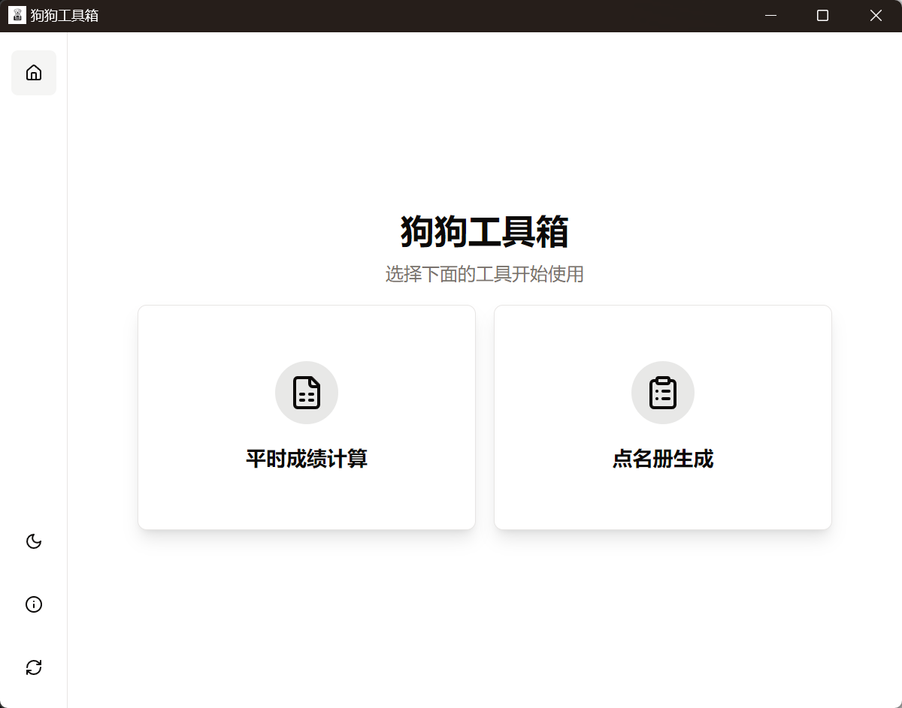
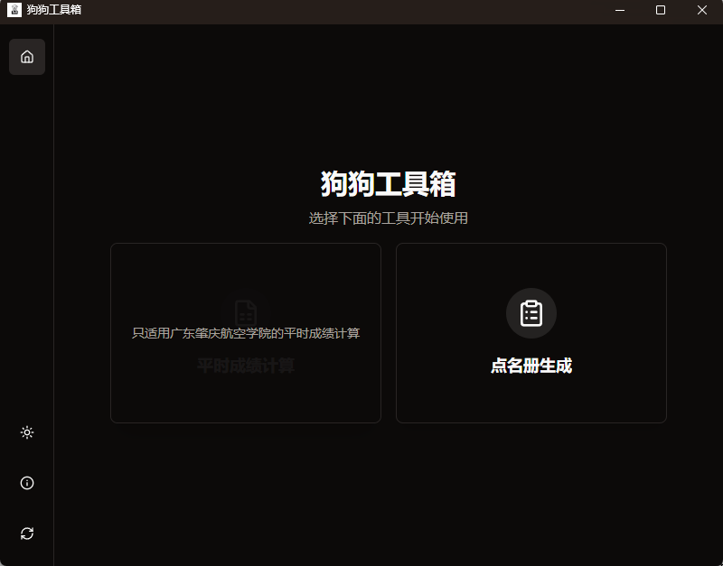
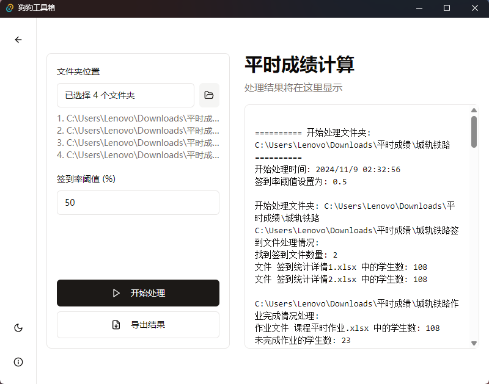

# 狗狗工具箱 (Dog Toolbox)

一款致力于让陈晓雨不累的软件。基于 Tauri + React + TypeScript 开发的桌面工具集合。

## 界面展示

### 主界面

### 平时成绩计算

## 功能特性

- 📊 平时成绩计算
  - 支持批量处理多个班级的签到和作业数据
  - 自动计算平时成绩
  - 导出成绩表格

## 技术栈

- [Tauri](https://tauri.app/) - 跨平台桌面应用开发框架
- [React](https://reactjs.org/) - 用户界面库
- [TypeScript](https://www.typescriptlang.org/) - 类型安全的 JavaScript
- [Tailwind CSS](https://tailwindcss.com/) - 原子化 CSS 框架
- [shadcn/ui](https://ui.shadcn.com/) - 可重用的UI组件库

## 开发环境要求

- [Node.js](https://nodejs.org/) (v18+)
- [Rust](https://www.rust-lang.org/) (最新稳定版)
- [pnpm](https://pnpm.io/) - 包管理器

